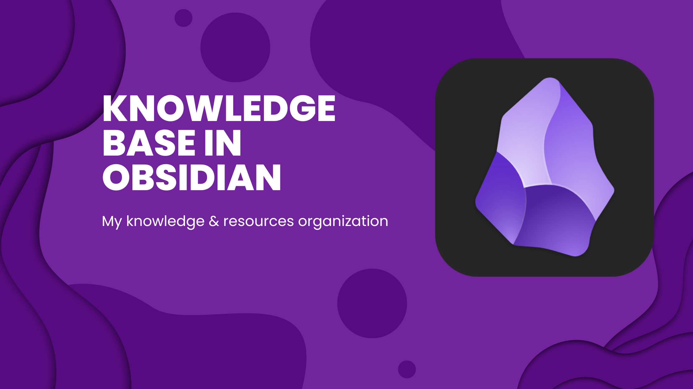

# 📖Obsidian Knowledge Base🔎

## What is Obsidian
[Obsidian](https://obsidian.md/) is both a Markdown editor and a knowledge base app.

Used in the most basic way, you can edit and preview Markdown files. But its true power lies in managing a densely networked knowledge base.

## Installation from Flatpack
The installation process is described in the next section - [Installation Obsidian from Flatpack](linux/Installation%20Obsidian%20from%20Flatpack.md).

## Obsidian Help
[Obsidian Help](https://help.obsidian.md/Home) - official Obsidian Help site, where you can find tips and guides on how to use.

