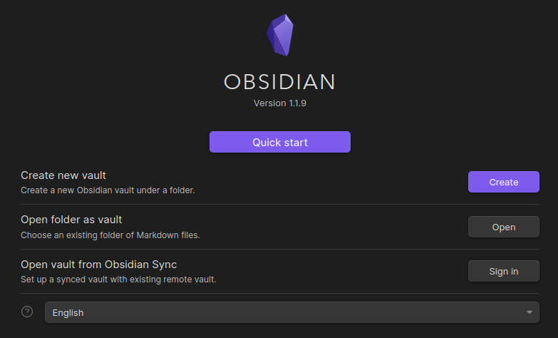

Устанавливаем из flatpak
```sh
flatpak install md.obsidian.Obsidian
```

Клонируем синхронизированный репозиторий
```sh
git clone git@github.com:kkulebaev/obsidian.git ~/obsidian
```

При открытии Obsidian выбираем пункт меню `Open folder as vault`, а затем указываем путь до директории клонированной из GitHub
