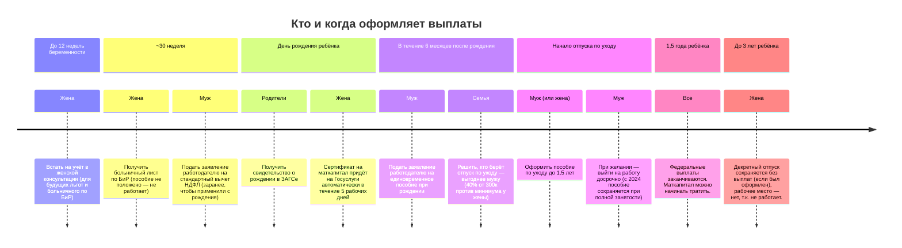

# Выплаты при рождении первого ребенка в России

Сводка по федеральным и региональным мерам поддержки семьи при рождении первого ребенка. Суммы индексируются ежегодно (обычно 1 февраля), актуальные значения сверять на [gosuslugi.ru](https://www.gosuslugi.ru/) и сайте СФР (Социальный фонд России).

> Дата сборки заметки: 2026-06-02. Перед подачей заявлений уточнять цифры — они могли быть проиндексированы.

## Кто и где оформляет

- **СФР** (Социальный фонд России, бывшие ПФР + ФСС) — большинство федеральных пособий.
- **Госуслуги** — подача заявлений онлайн, статус выплат.
- **МФЦ** — очная подача документов.
- **Работодатель** — пособие по беременности и родам, пособие по уходу до 1,5 лет (для работающих по ТК), стандартный налоговый вычет НДФЛ.
- **Соцзащита региона** — региональные доплаты, губернаторские выплаты.

## Федеральные выплаты

### До родов (только женщине)

#### Пособие по беременности и родам (декретные)

- Кому: работающим по ТК, ИП с добровольными взносами в СФР, студенткам очной формы, военнослужащим по контракту, уволенным при ликвидации.
- За что: 140 дней отпуска по БиР (70 до + 70 после). При осложнённых родах — 156 дней, при многоплодной беременности — 194 дня.
- Сколько: 100% среднего заработка за 2 предыдущих календарных года.
- Лимиты-2026: ограничено предельной базой СФР. Минимум — из МРОТ, максимум — из предельной базы.
- Оформление: работодатель сам отправляет данные в СФР после получения больничного.

#### Единое пособие беременной женщине

- Кому: вставшим на учёт в женской консультации до 12 недель, если среднедушевой доход семьи ниже регионального прожиточного минимума (ПМ).
- Сколько: 50%, 75% или 100% регионального ПМ для трудоспособного — назначается комплексной оценкой нуждаемости.
- Оформление: заявление на Госуслугах, проверяется имущество и доходы за 12 месяцев (правило «нулевого дохода»).

### При рождении (однократно)

#### Единовременное пособие при рождении ребенка

- Кому: одному из родителей (любому), независимо от занятости и дохода.
- Сколько: индексируется ежегодно. На 2026 — порядка 26 900 ₽ (уточнить актуальную сумму).
- Срок подачи: 6 месяцев со дня рождения.
- Оформление: работающим — через работодателя; неработающим — через СФР/Госуслуги.

#### Материнский (семейный) капитал

- Кому: с 2020 года выдаётся уже на первого ребёнка.
- Сколько: на 2026 — около 690 000 ₽ на первого ребёнка (точную сумму после индексации февраля 2026 проверить на sfr.gov.ru).
- На что можно потратить:
  - улучшение жилищных условий (в т.ч. как первоначальный взнос или погашение ипотеки),
  - образование детей,
  - накопительная пенсия матери,
  - адаптация ребёнка-инвалида,
  - ежемесячная выплата нуждающимся семьям до 3 лет.
- Оформление: проактивно — сертификат приходит в личный кабинет на Госуслугах автоматически после регистрации рождения.

### После рождения (ежемесячно)

#### Пособие по уходу за ребенком до 1,5 лет

- Кому: лицу, фактически осуществляющему уход (мать, отец, бабушка и т.д.).
- Сколько:
  - работающим — 40% среднего заработка за 2 предыдущих года (минимум и максимум по СФР);
  - неработающим — минимальная сумма, индексируется ежегодно.
- С 2024 года: пособие сохраняется при досрочном выходе на работу из отпуска по уходу.
- Оформление: работающим — через работодателя; неработающим — через СФР.

#### Единое пособие на ребенка от 0 до 17 лет

- Кому: семьям с доходом ниже регионального ПМ на человека, при прохождении комплексной оценки нуждаемости (имущество, «правило нулевого дохода»).
- Сколько: 50%, 75% или 100% ПМ на ребёнка в регионе.
- Совместимость: единое пособие до 1,5 лет можно получать одновременно с пособием по уходу из СФР.
- Оформление: одно заявление на Госуслугах, переоформление раз в 12 месяцев.

### Налоговые льготы

#### Стандартный налоговый вычет по НДФЛ

- Кому: обоим родителям, работающим по ТК (или единственному родителю в двойном размере).
- Сколько на первого ребёнка: 1 400 ₽ из налогооблагаемой базы ежемесячно — то есть экономия 182 ₽ в месяц по ставке 13%.
- Действует до месяца, в котором годовой доход превысит установленный лимит (проверить актуальный порог за 2026 год).
- Оформление: заявление работодателю + копия свидетельства о рождении.

#### Имущественные и ипотечные льготы

- **Семейная ипотека** — ставка до 6% для семей с ребёнком, рождённым с 2018 года. Условия программы периодически меняются — проверять параметры на 2026 год.
- **Имущественный вычет при покупке жилья** — стандартный, не привязан к ребёнку, но материнский капитал можно использовать как первый взнос.

## Региональные выплаты

Размер и условия сильно зависят от субъекта РФ. Самые распространённые виды:

- **Региональный материнский капитал** — есть во многих регионах (СПб, МО, Татарстан, ХМАО и др.), суммы от 30 тыс. до 200+ тыс. рублей.
- **Губернаторские выплаты** при рождении первого ребёнка — единовременная сумма от региона.
- **Выплата молодой семье** — в Москве «Лужковские» (для родителей младше 36 лет, зарегистрированных в Москве).
- **Региональные ежемесячные пособия** для нуждающихся семей сверх федерального единого пособия.

Уточнять на сайте соцзащиты конкретного региона и через Госуслуги (раздел «Жизненные ситуации → Рождение ребёнка»).

## Сроки подачи и чек-лист документов

Базовый пакет:

- свидетельство о рождении;
- паспорта родителей;
- СНИЛС всех членов семьи;
- справка о составе семьи / выписка из домовой книги (часто запрашивается автоматически);
- реквизиты карты «МИР» (для всех детских пособий — обязательно МИР, не Visa/MC);
- свидетельство о браке (при наличии);
- для нуждающихся выплат — справки о доходах за 12 месяцев (часто подтягиваются из ФНС автоматически).

Ключевые сроки:

| Выплата | Срок обращения |
|---|---|
| Пособие по БиР | в течение 6 мес. после окончания отпуска по БиР |
| Единовременное при рождении | 6 мес. со дня рождения |
| Маткапитал | без срока (сертификат оформляется проактивно) |
| Пособие по уходу до 1,5 лет | 6 мес. после достижения 1,5 лет |
| Единое пособие | в любой момент, переоформление раз в 12 мес. |

## Сценарий: муж работает (300 000 ₽/мес до НДФЛ), жена не работает

### Что положено, а что — нет

| Выплата | Положена? | Почему |
|---|---|---|
| Пособие по БиР (декретные) | Нет | Жена не работает и не уволена при ликвидации; мужчинам не выплачивается. |
| Единое пособие беременной | Нет | Доход семьи 300 000 ₽ / 2 чел. = 150 000 ₽ на человека — многократно выше ПМ. |
| Единовременное при рождении | Да | Оформляет муж через работодателя. |
| Материнский капитал | Да | Сертификат приходит жене проактивно на Госуслуги. |
| Пособие по уходу до 1,5 лет | Да | Можно оформить либо на жену (минимум от СФР), либо на мужа (40% от зарплаты, с лимитом — выгоднее). |
| Единое пособие на ребёнка 0–17 | Нет | Не пройдут оценку нуждаемости по доходу. |
| Стандартный вычет НДФЛ | Да | На мужа, 1 400 ₽ из базы, но только 1 месяц в году — превышается лимит 450 000 ₽. |
| Семейная ипотека (если планируется жильё) | Да | Льготная ставка после рождения первого ребёнка. |

### Таймлайн действий

### Расчёт сумм

Все цифры — ориентировочные на 2026 год, проверять актуальные на sfr.gov.ru перед оформлением.

| Выплата | Получатель | Расчёт | Сумма |
|---|---|---|---|
| Единовременное при рождении | Муж | Фиксированная индексируемая сумма | ~28 800 ₽ единовременно |
| Маткапитал на первого ребёнка | Жена (сертификат) | Фиксированная индексируемая сумма | ~700 000 ₽ единовременно (целевое использование) |
| Пособие по уходу до 1,5 лет — **вариант А: оформляет жена** | Жена | Минимальный размер от СФР × 18 мес. | ~11 000 ₽/мес × 18 = **~198 000 ₽** |
| Пособие по уходу до 1,5 лет — **вариант Б: оформляет муж** | Муж | 40% от средней з/п, но капается лимитом СФР. 40% от 300 000 = 120 000 ₽, лимит-2026 ≈ 75–80 000 ₽/мес | ~78 000 ₽/мес × 18 = **~1 404 000 ₽** |
| Стандартный вычет НДФЛ | Муж | 1 400 ₽ × 13% = 182 ₽/мес. Лимит дохода 450 000 ₽ достигается на 2-м месяце → вычет работает только в январе | **~182 ₽/год** (пренебрежимо) |

### Итого по сценарию

| Стратегия | Сумма за первые 1,5 года | Комментарий |
|---|---|---|
| Уход оформляет жена | ~28 800 + 700 000 (целевые) + 198 000 = **~927 000 ₽**, из них живых денег **~227 000 ₽** | Муж работает в обычном режиме. |
| Уход оформляет муж + досрочный выход на работу | ~28 800 + 700 000 (целевые) + 1 404 000 = **~2 133 000 ₽**, из них живых денег **~1 433 000 ₽** | С 2024 г. пособие сохраняется при выходе на работу — это значительно выгоднее. |

> ⚠️ Вариант Б требует оформить именно на мужа отпуск по уходу. Юридически возможно: его берёт один из родителей (или другой родственник) по выбору семьи. При досрочном выходе на работу с сохранением пособия — фактически муж получает и зарплату 300 000 ₽, и пособие ~78 000 ₽/мес.

### Что ещё уточнить

- Региональные выплаты Москвы / СПб / вашего региона — могут дать +30–200 тыс. ₽ дополнительно (часть без проверки нуждаемости, часть с).
- Лимит и максимум пособия по уходу на 2026 год — пересчитать после публикации новой предельной базы СФР.
- Полная индексация всех федеральных пособий с 1 февраля 2026 — суммы выше нужно актуализировать.

## Полезные ссылки

- [Госуслуги — Рождение ребёнка](https://www.gosuslugi.ru/life/details/birth_of_a_child)
- [СФР — Социальный фонд России](https://sfr.gov.ru/)
- [ФНС — налоговые вычеты](https://www.nalog.gov.ru/)
